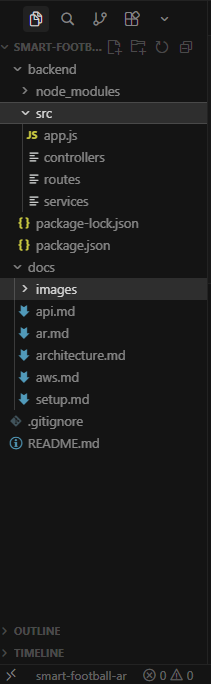
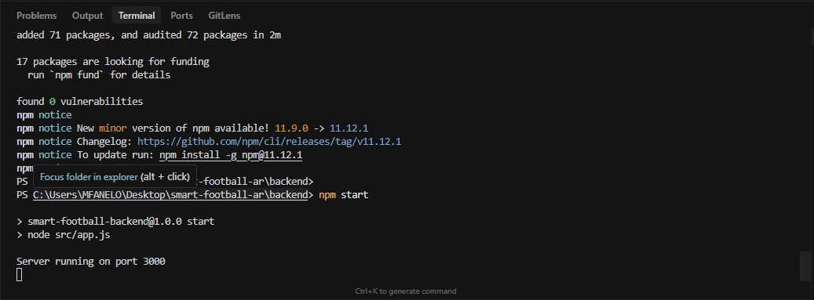
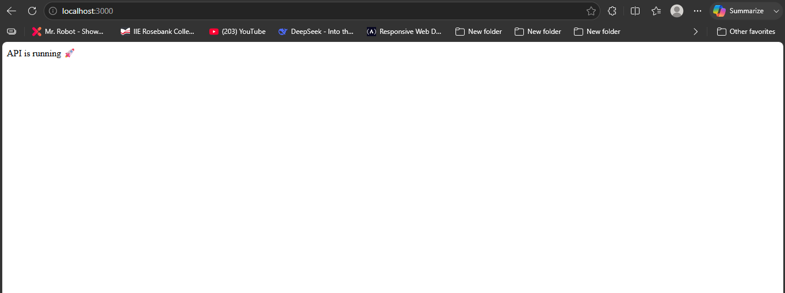

# ⚽ Smart Football AR Experience + Cloud Backend

## 📌 Overview
This project combines Augmented Reality with Cloud Computing to create an interactive football experience.

Users interact with a virtual football object using a Snapchat Lens, which connects to a cloud-based backend system built with AWS.

---

## 🧠 Architecture
- AR Lens (Snapchat Lens Studio)
- Backend API (Node.js + Express)
- Cloud Services (AWS)

---

## ⚙️ Tech Stack
- Lens Studio (AR)
- Node.js + Express (Backend)
- AWS (Cloud)

---

## 🚀 Current Progress
- [x] Project setup
- [x] Backend initialized
- [ ] AR Lens development
- [ ] API integration
- [ ] AWS deployment

---

## 📸 Project Preview

### 📁 Project Structure

### 🚀 Backend Running

### 🌐 API Response

## 📚 Documentation

- [Setup Guide](./docs/setup.md)
- [Backend Overview](./docs/backend.md)
- [Architecture](./docs/architecture.md)